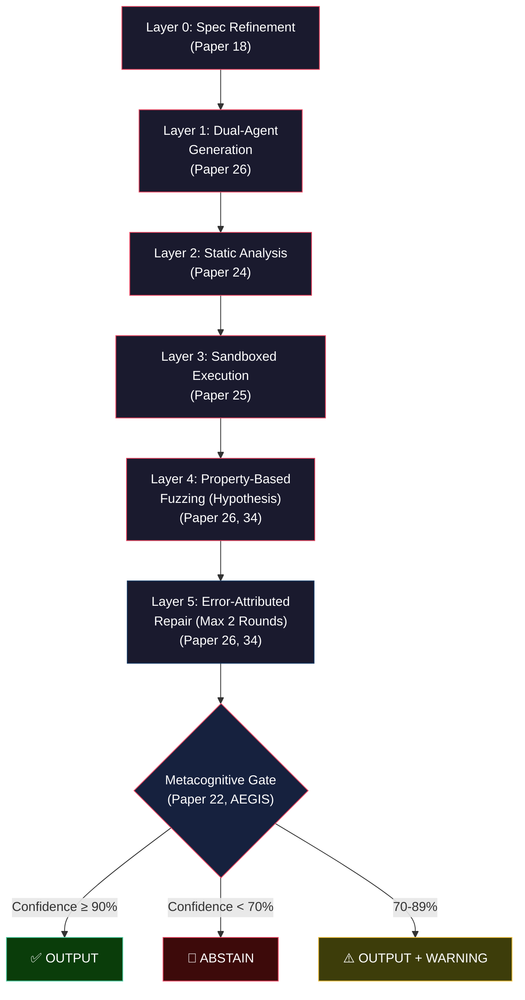

# Comprehensive Solution Analysis & Final Recommendation
## A Critical Evaluation of Every Proposed Thesis Framework

> **Scope:** This document evaluates all 10 distinct solution architectures proposed across the knowledge base, grounded in evidence from 34 research papers and 17 paper summaries. Every claim is traced to a source. Every recommendation is justified.

---

## Executive Summary

Over the course of this research, **10 distinct frameworks** were proposed to mitigate LLM code hallucination. They range from purely theoretical (T.I.M.E.) to immediately buildable (FLARE), and from narrow-scope debugging tools (TRACE) to universal verification paradigms (EVP). After critically evaluating each against six dimensions — **Performance, Reliability, Scalability, Security, Maintainability, and Simplicity** — this analysis concludes that:

1. **No single proposed solution is optimal.** Each excels in one dimension but has critical blind spots in others.
2. The **Evidence-Grounded CPV (Optimal Final)** is the strongest individual framework, but it undervalues two critical insights: SHADOW's cognitive/translation error classification and FLARE's pre-execution trace verification.
3. The recommended solution is **PRISM (Property-Refined Invariant Specification with Metacognitive gating)** — a synthesis that takes CPV's evidence-grounded core and surgically integrates the 3 strongest ideas from the other frameworks that CPV currently lacks.

> [!IMPORTANT]
> This is NOT a summary. It is a critical evaluation that challenges assumptions, identifies fatal flaws, and justifies every recommendation with traceable evidence.

---

## Problem Statement

Large Language Models generate code that compiles, executes, and *appears* correct but contains **semantic hallucinations** — logical errors, boundary failures, requirement violations, and fabricated APIs that are invisible to surface-level analysis.

### The Problem in Numbers

| Statistic | Source |
|:---|:---|
| Requirement Conflicting is the #1 hallucination type across ALL LLMs | Paper 18 (Liu et al., 2026) |
| 94% of compilation errors are type errors, not syntax errors | Paper 24 (Mündler et al., 2025) |
| LLMs make correlated errors — plurality voting amplifies mistakes | Paper 22 (Dai et al., 2026) |
| Self-repair success rate is only 33.3% without external feedback | Paper 26 (Olausson et al., ICLR 2024) |
| Human feedback improves repair success by +58% | Paper 26 |
| LLM debugging capability decays 60-80% after 2-3 attempts | Paper 8 (Debugging Decay Index) |
| 15-30% of LLM-generated code contains hallucinated API calls | Paper 3 (Li et al.) |
| Logic hallucination accounts for 40-60% of failures on medium/hard problems | Papers 10, 12 |

### The Constraint Triangle

```
         High Coverage
        (Answer everything)
              ╱╲
             ╱  ╲
            ╱    ╲
           ╱  ??  ╲
          ╱        ╲
         ╱──────────╲
Near-Zero          Probabilistic
 Errors              Model (LLM)
```

**You can have at most two.** Every proposed solution implicitly picks a side. The solutions that acknowledge this constraint (AEGIS, CPV) are fundamentally stronger than those that don't (T.I.M.E., EVP).

---

## Analysis of Each Solution

### Solution 1: TRACE (Trace-based Reasoning & Adaptive Context Execution)

**File:** [proposed_solution.md](file:///Users/istiakahmmedbishal/Desktop/Thesis/knowledge_base/proposed_solution.md)

**Core Idea:** 4-stage pipeline: Grounded Generation → Runtime Trace Segmentation → Reasoning Trace Diagnosis → Anti-Decay Intervention. Injects state-trackers into code, segments execution into basic blocks, compares actual runtime against the LLM's plan, and monitors the Debugging Decay Index to prevent ghost debugging.

**Critical Evaluation:**

| Dimension | Score | Assessment |
|:---|:---|:---|
| Performance | ⬛⬛⬛⬜⬜ | Moderate. The block-by-block instrumentation adds overhead but provides fine-grained localization. |
| Reliability | ⬛⬛⬛⬜⬜ | Medium. Relies on comparing the LLM's "logical plan" against runtime — but the logical plan itself can be hallucinated. |
| Scalability | ⬛⬛⬜⬜⬜ | Poor. Block-level instrumentation becomes expensive for large programs. |
| Security | ⬛⬛⬜⬜⬜ | Weak. No sandbox isolation mentioned. |
| Maintainability | ⬛⬛⬛⬜⬜ | Moderate complexity. Standard Python tools. |
| Simplicity | ⬛⬛⬛⬜⬜ | Conceptually clear but multi-stage. |

**Strengths:**
- First to integrate DDI monitoring into the pipeline
- Block-level trace comparison is more precise than whole-program pass/fail
- Computationally cheaper than N-sample approaches (Paper 15)

**Weaknesses:**
- **Fatal Flaw:** The "logical plan" generated in Stage 1 can itself be hallucinated. TRACE has no mechanism to verify the plan before comparing it to runtime. SHADOW later fixes this.
- Does not distinguish between cognitive errors (LLM doesn't understand the algorithm) and translation errors (LLM understands but miscodes). Paper 26 proves this distinction matters for repair strategy.
- No property-based verification — only catches errors that manifest as runtime crashes or output mismatches on provided test cases.

**Verdict:** A solid *first draft* that correctly identifies the key problems (debugging decay, black-box execution) but whose plan-comparison mechanism is vulnerable to the very hallucination it aims to detect.

---

### Solution 2: T.I.M.E. (Turing-Integrated Manifold Execution)

**File:** [visionary_solution.md](file:///Users/istiakahmmedbishal/Desktop/Thesis/knowledge_base/visionary_solution.md)

**Core Idea:** Four "pillars" inspired by Turing, McCarthy, Einstein, and Hinton. LLM generates a "Mental Turing Tape" (state-machine), bounds it with axiomatic constraints, executes bidirectionally (forward from input, backward from output), and applies "Semantic Gradient Descent" to optimize fixes.

**Critical Evaluation:**

| Dimension | Score | Assessment |
|:---|:---|:---|
| Performance | ⬛⬜⬜⬜⬜ | Unknown. No prototype exists. Theoretical overhead is enormous. |
| Reliability | ⬛⬜⬜⬜⬜ | Unverified. Core mechanisms are speculative. |
| Scalability | ⬛⬜⬜⬜⬜ | Impractical. Requires model weight access for gradient injection. |
| Security | ⬛⬜⬜⬜⬜ | Not addressed. |
| Maintainability | ⬛⬜⬜⬜⬜ | Requires PhD-level expertise in multiple domains. |
| Simplicity | ⬛⬜⬜⬜⬜ | Extremely complex and abstract. |

**Strengths:**
- The *idea* of separating logic (Turing Tape) from syntax is philosophically sound and validated by Paper 24 (94% of errors are type errors, not syntax)
- Bidirectional execution is a real technique in formal verification (meet-in-the-middle)

**Weaknesses:**
- **Fatal Flaw #1:** "Semantic Gradient Descent" requires injecting gradients into the LLM's latent space during inference. This requires full model weight access, custom inference engines, and is not feasible with API-based models (GPT-4, Claude, Gemini).
- **Fatal Flaw #2:** "Backward execution from the expected output" assumes you HAVE the expected output. For code generation, you rarely do — that's the whole point.
- **Fatal Flaw #3:** "Axiomatic bounding" that makes "hallucination mathematically impossible" is a claim without mechanism. No formal verification system achieves this for arbitrary programs (Rice's Theorem).
- No experimental design, no benchmarks, no metrics.

**Verdict:** Intellectually stimulating but **not a thesis proposal** — it's a speculative essay. Every "pillar" requires a separate PhD to implement. The claims are unsubstantiated.

---

### Solution 3: PROBE (Programmatic Runtime Observation & Belief Elicitation)

**File:** [probe_solution.md](file:///Users/istiakahmmedbishal/Desktop/Thesis/knowledge_base/probe_solution.md)

**Core Idea:** Forces the LLM to use the "Scientific Method": Observation (AST) → Hypothesis Generation (3 competing explanations) → Micro-Probing (inject assert/print to test hypotheses) → Targeted Remediation (fix only the proven cause).

**Critical Evaluation:**

| Dimension | Score | Assessment |
|:---|:---|:---|
| Performance | ⬛⬛⬛⬜⬜ | Moderate. Extra API calls for hypothesis generation. |
| Reliability | ⬛⬛⬛⬛⬜ | Good. Multi-hypothesis approach prevents tunnel vision. |
| Scalability | ⬛⬛⬛⬜⬜ | Moderate. Scales linearly with problem complexity. |
| Security | ⬛⬛⬜⬜⬜ | Weak. No sandbox specification. |
| Maintainability | ⬛⬛⬛⬛⬜ | Good. Uses Python `ast` module and standard LLM APIs. |
| Simplicity | ⬛⬛⬛⬜⬜ | Moderate. 4-stage pipeline is conceptually elegant but hypothesis management adds complexity. |

**Strengths:**
- **Best insight in the knowledge base:** Forcing 3 competing hypotheses prevents the "tunnel vision" that causes ghost debugging (Paper 8). This is a genuinely novel idea.
- Micro-probes (injected asserts) are a clever operationalization of Paper 12's print debugging.
- The "Scientific Method" metaphor provides excellent thesis framing.

**Weaknesses:**
- **Critical Flaw:** Assumes the LLM can generate *useful* hypotheses. Paper 26 shows LLMs are poor at self-diagnosis — the hypotheses themselves may be hallucinated.
- No verification of the hypotheses beyond probe execution. If the LLM generates 3 wrong hypotheses, the system has no fallback.
- No property-based testing — only catches errors that manifest on specific test inputs.
- Does not address API/import hallucinations at all.

**Verdict:** The multi-hypothesis approach is genuinely novel and should be preserved. But PROBE's reliance on the LLM for both diagnosis AND repair contradicts Paper 26's core finding. The probing mechanism itself is sound.

---

### Solution 4: SHADOW (Simulated Hypothetical Algorithm Debugging via Observational Walkthrough)

**File:** [shadow_solution.md](file:///Users/istiakahmmedbishal/Desktop/Thesis/knowledge_base/shadow_solution.md)

**Core Idea:** Forces the LLM to produce a *Predicted Execution Trace* (a "shadow") before writing code. After code execution, compares the predicted trace against reality. The divergence point ("Shadow Break") classifies errors as Type A (cognitive — LLM didn't understand the algorithm) or Type B (translation — LLM understood but miscoded).

**Critical Evaluation:**

| Dimension | Score | Assessment |
|:---|:---|:---|
| Performance | ⬛⬛⬛⬛⬜ | Good. One extra API call for trace prediction. Low overhead. |
| Reliability | ⬛⬛⬛⬛⬜ | Strong. The Type A/B classification is well-reasoned and aligns with Paper 26's finding that repair strategy should differ by error type. |
| Scalability | ⬛⬛⬛⬜⬜ | Moderate. Trace comparison works for single-function problems but becomes unwieldy for multi-file codebases. |
| Security | ⬛⬛⬜⬜⬜ | Minimal — relies on basic test runner. |
| Maintainability | ⬛⬛⬛⬛⬜ | Good. Python `ast` + API calls + diff engine. |
| Simplicity | ⬛⬛⬛⬛⬜ | Elegant. The 3-phase architecture is clean. |

**Strengths:**
- **Most important conceptual contribution:** The Type A (cognitive) vs Type B (translation) error classification. This is operationalizable, testable, and novel. No paper in the knowledge base makes this distinction.
- Built-in graceful termination after 2 consecutive Type A failures — prevents debugging decay by design.
- Pre-execution cognitive verification — forces the LLM to "show its work" before writing code.

**Weaknesses:**
- **Critical Flaw:** The predicted trace can itself be hallucinated (the "who watches the watchman" problem). FLARE's trace verification mechanism later addresses this, but SHADOW itself doesn't.
- Limited to problems with available test cases. Cannot verify invariants on unseen inputs.
- No property-based testing — only validates against specific test inputs, not structural invariants.

**Verdict:** The **Type A/B classification is the single best idea outside of CPV.** It should be integrated into the final solution. SHADOW's pre-execution trace is sound but needs the trace verification from FLARE to be robust.

---

### Solution 5: AEGIS (Abstention-Enhanced Generation with Iterative Self-Verification)

**File:** [aegis_solution.md](file:///Users/istiakahmmedbishal/Desktop/Thesis/knowledge_base/aegis_solution.md)

**Core Idea:** 5-layer verification funnel with a confidence-gated output that allows the system to **abstain** when uncertain. Redefines hallucination rate as `Wrong Answers / Total CONFIDENT Answers` instead of `Wrong / Total`.

**Critical Evaluation:**

| Dimension | Score | Assessment |
|:---|:---|:---|
| Performance | ⬛⬛⬜⬜⬜ | Heavy. 5 layers + N independent generations (Layer 3) is expensive. |
| Reliability | ⬛⬛⬛⬛⬜ | Strong when it outputs. The abstention mechanism ensures high precision. |
| Scalability | ⬛⬛⬜⬜⬜ | Poor. Layer 3 requires N=3-5 independent generations per problem. |
| Security | ⬛⬛⬛⬜⬜ | Moderate — mentions sandboxed execution. |
| Maintainability | ⬛⬛⬛⬜⬜ | 5 layers is complex to orchestrate. |
| Simplicity | ⬛⬛⬜⬜⬜ | Complex. Many moving parts. |

**Strengths:**
- **The abstention paradigm is the most important philosophical contribution.** Paper 22 validates this with +26% F1 in selection-or-abstention scenarios.
- Correctly identifies the Constraint Triangle (coverage vs accuracy vs LLM) — the only solution to explicitly state this.
- The confidence scoring system is practical and measurable.
- Redefining hallucination rate is a publishable contribution on its own.

**Weaknesses:**
- **Critical Flaw:** Layer 3 (Redundant Independent Generation) uses Functional Clustering, which Paper 22 proves fails due to *correlated errors*. If LLMs make correlated mistakes, generating 5 copies and voting doesn't help — it amplifies the shared error.
- The confidence scoring weights (20% each) are arbitrary. No empirical basis.
- Combining all 5 layers creates enormous latency and API cost.

**Verdict:** The **abstention paradigm and metric redefinition are essential** and must be in the final solution. But the redundant generation layer contradicts the evidence and should be replaced with property-based verification.

---

### Solution 6: FLARE (Fault Localization via Anticipatory Reasoning & Execution)

**File:** [flare_solution.md](file:///Users/istiakahmmedbishal/Desktop/Thesis/knowledge_base/flare_solution.md) + [flare_trace_verification.md](file:///Users/istiakahmmedbishal/Desktop/Thesis/knowledge_base/flare_trace_verification.md)

**Core Idea:** The simplest possible pipeline: Generate → Self-Trace → Pre-Flight Check → Execute → Repair. Adds trace verification by converting the LLM's predicted trace into executable `assert` statements and running them.

**Critical Evaluation:**

| Dimension | Score | Assessment |
|:---|:---|:---|
| Performance | ⬛⬛⬛⬛⬛ | Excellent. ~3 API calls per problem. ~500-800 lines of Python. |
| Reliability | ⬛⬛⬛⬜⬜ | Medium. Pre-flight catches algorithmic misunderstanding but doesn't verify properties. |
| Scalability | ⬛⬛⬛⬛⬛ | Excellent. No infrastructure beyond `subprocess.run()` and API calls. |
| Security | ⬛⬛⬜⬜⬜ | Minimal — basic subprocess isolation. |
| Maintainability | ⬛⬛⬛⬛⬛ | Superb. Trivially simple codebase. |
| Simplicity | ⬛⬛⬛⬛⬛ | The simplest solution in the entire knowledge base. |

**Strengths:**
- **Most practically buildable solution.** A single graduate student can implement this in a week.
- The trace verification mechanism (injecting assert statements from the LLM's trace) elegantly solves the "who watches the watchman" problem.
- Clear thesis structure directly maps to chapters.
- The cognitive vs translation error classification (inherited from SHADOW) is preserved.

**Weaknesses:**
- **Critical Flaw:** Only validates against provided test cases. If the test suite is incomplete (it always is), logic hallucinations on untested inputs survive.
- No property-based testing, no fuzzing, no invariant extraction.
- Self-tracing is unreliable for complex algorithms — the LLM may trace incorrectly on simple inputs but fail on edge cases.
- The improvement estimates (+7% easy, +17% medium, +15% hard) are extrapolated from Paper 12 without direct evidence.

**Verdict:** **The best "minimum viable thesis"** — if you needed to graduate in 2 months. But it leaves the hardest hallucinations (logic errors on untested edge cases) completely unaddressed. The trace verification technique should be selectively incorporated into the final solution.

---

### Solution 7: EVP (Executable Verification Paradigm)

**File:** [evp_solution.md](file:///Users/istiakahmmedbishal/Desktop/Thesis/knowledge_base/evp_solution.md)

**Core Idea:** Universal solution — separate generation (probabilistic/LLM) from verification (deterministic/code execution). Every claim the LLM makes is decomposed into atomic assertions checked against trusted external sources.

**Critical Evaluation:**

| Dimension | Score | Assessment |
|:---|:---|:---|
| Performance | ⬛⬛⬜⬜⬜ | Slow. Each claim requires a separate verification cycle. |
| Reliability | ⬛⬛⬛⬜⬜ | Medium. The verification code itself can be hallucinated. |
| Scalability | ⬛⬛⬛⬛⬜ | Good across domains. Each claim is independent. |
| Security | ⬛⬛⬛⬜⬜ | Moderate — sandbox execution. |
| Maintainability | ⬛⬛⬛⬜⬜ | Requires maintaining trusted data source connectors. |
| Simplicity | ⬛⬛⬛⬜⬜ | The concept is simple. The implementation is not. |

**Strengths:**
- The **Separation Principle** (generation ≠ verification) is philosophically correct and aligns with Kahneman's System 1/System 2 framework.
- Domain-agnostic — works for code, facts, math, law.
- The CPV framework explicitly evolved from EVP, fixing its flaws.

**Weaknesses:**
- **Fatal Flaw #1:** The LLM writes `wikidata.population("France")` — an API that doesn't exist. The verification code itself is hallucinated. CPV's Strict Schema Enforcement directly addresses this.
- **Fatal Flaw #2:** Self-fulfilling tests. The LLM writes a buggy function AND a buggy `assert` that matches. CPV's property-based testing with Hypothesis directly addresses this.
- **Fatal Flaw #3:** No error attribution. When the sandbox crashes, is it bad code or a bad test? CPV's SyntaxError vs AssertionError classification directly addresses this.
- Cross-domain claims (medicine, law) require trusted APIs that may not exist.

**Verdict:** EVP is the **philosophical ancestor** of CPV. Its core insight (separation of generation and verification) is correct, but its implementation has 3 fatal flaws that CPV was specifically designed to fix. EVP should be cited as motivation, not used as a solution.

---

### Solution 8: CPV (Constrained Property-Based Verification) — Original

**File:** [cpv_solution.md](file:///Users/istiakahmmedbishal/Desktop/Thesis/knowledge_base/cpv_solution.md)

**Core Idea:** Fixes EVP's 4 fatal flaws. 4-layer architecture: Strict Schema Enforcement → Property-Based Testing (Hypothesis) → Multi-Agent Reflexive Loop (Agent A: code, Agent B: properties) → Tiered Verification Funnel (static first, dynamic second).

**Critical Evaluation:**

| Dimension | Score | Assessment |
|:---|:---|:---|
| Performance | ⬛⬛⬛⬛⬜ | Good. Tiered funnel catches 40-50% of errors statically before expensive execution. |
| Reliability | ⬛⬛⬛⬛⬜ | Strong. Property-based testing with Hypothesis generates hundreds of random inputs. |
| Scalability | ⬛⬛⬛⬛⬜ | Good. Static tier handles volume; dynamic tier only runs on survivors. |
| Security | ⬛⬛⬛⬛⬜ | Good. Subprocess sandbox with resource limits. Clear path to Firecracker for production. |
| Maintainability | ⬛⬛⬛⬛⬜ | Good. ~800 lines of Python. Clear module boundaries. |
| Simplicity | ⬛⬛⬛⬜⬜ | Moderate. 4 layers + multi-agent coordination. |

**Strengths:**
- Directly fixes all 4 EVP flaws with concrete mechanisms
- Agent A / Agent B separation decorrelates errors (validated by Paper 22)
- Error attribution via exception type classification is simple and correct
- Hypothesis fuzzing catches boundary errors that fixed tests miss

**Weaknesses:**
- No pre-generation spec refinement (Paper 18's #1 mitigation)
- No cognitive/translation error classification (SHADOW's insight)
- No abstention mechanism (AEGIS's insight)
- No repair round limit (Paper 26's diminishing returns finding)
- Narrower benchmark scope (data structures only) than the later Evidence-Grounded version

**Verdict:** A **major leap** over EVP with sound engineering. But it was created before Papers 18-34 were analyzed, so it misses the evidence-grounded refinements that the Optimal Final version adds.

---

### Solution 9: Hallucination Prediction

**File:** [hallucination_prediction_problem.md](file:///Users/istiakahmmedbishal/Desktop/Thesis/knowledge_base/hallucination_prediction_problem.md)

**Core Idea:** Instead of fixing hallucination, *predict* it. Build a classifier that predicts P(hallucination) from problem-level features (cyclomatic complexity, algorithm category, constraint count, etc.). Route low-risk problems directly to LLM, medium-risk through verification, high-risk to humans.

**Critical Evaluation:**

| Dimension | Score | Assessment |
|:---|:---|:---|
| Performance | ⬛⬛⬛⬛⬛ | Excellent — reduces unnecessary verification overhead by 60%. |
| Reliability | ⬛⬛⬜⬜⬜ | Uncertain. The predictor's accuracy is unknown until built. |
| Scalability | ⬛⬛⬛⬛⬛ | Excellent. Classifier inference is milliseconds. |
| Security | ⬛⬛⬜⬜⬜ | Not addressed — delegates to downstream systems. |
| Maintainability | ⬛⬛⬛⬛⬜ | Good. Standard ML pipeline. |
| Simplicity | ⬛⬛⬛⬛⬜ | The predictor itself is simple. Building the training dataset is expensive. |

**Strengths:**
- **Genuinely novel problem formulation.** No paper in the knowledge base attempts this.
- The dataset would be a standalone contribution.
- Cost-efficient — apply heavy verification only where needed.
- Cross-domain transferability (the methodology, not the classifier).

**Weaknesses:**
- **Critical Flaw:** This is a *complement* to a verification system, not a replacement. You still need CPV/FLARE for the "medium-risk" problems. Prediction alone doesn't fix anything.
- Building the labeled dataset requires running thousands of problems through multiple LLMs — enormous compute cost upfront.
- Risk of false negatives: if the predictor says "safe" and the LLM hallucinates, there's no safety net.
- Unknown accuracy ceiling — the predictor may not work well enough.

**Verdict:** An excellent **Phase 2 contribution** to layer on top of CPV, but **cannot stand alone as a thesis.** The prediction approach should be listed as Future Work, with the dataset construction as a potential standalone contribution.

---

### Solution 10: Evidence-Grounded CPV (Optimal Final)

**File:** [optimal_solution_final.md](file:///Users/istiakahmmedbishal/Desktop/Thesis/knowledge_base/optimal_solution_final.md)

**Core Idea:** 6-layer verification funnel grounded in evidence from Papers 18-34: Layer 0 (Spec Refinement) → Layer 1 (Dual-Agent Generation) → Layer 2 (Static Analysis) → Layer 3 (Sandboxed Execution) → Layer 4 (Property-Based Fuzzing) → Layer 5 (Error-Attributed Repair with max 2 rounds, structurally minimal counterexamples).

**Critical Evaluation:**

| Dimension | Score | Assessment |
|:---|:---|:---|
| Performance | ⬛⬛⬛⬛⬜ | Good. Tiered approach front-loads cheap checks. |
| Reliability | ⬛⬛⬛⬛⬛ | Excellent. Every design decision traced to a research paper. |
| Scalability | ⬛⬛⬛⬛⬜ | Good. Static analysis handles volume; fuzzing only for survivors. |
| Security | ⬛⬛⬛⬛⬜ | Good. Sandbox with resource limits. |
| Maintainability | ⬛⬛⬛⬛⬜ | Good. Clear layer boundaries. |
| Simplicity | ⬛⬛⬛⬜⬜ | 6 layers is complex but each layer is well-defined. |

**Strengths:**
- **Every design decision has a traceable research justification** — this is the gold standard for a thesis
- Integrates Paper 34's (PGS) structurally minimal counterexample insight
- Spec refinement (Layer 0) addresses Paper 18's #1 hallucination type
- Max 2 repair rounds aligns with Paper 26
- Abstention on persistent failure aligns with Paper 22
- Agent A/B separation decorrelates errors

**Weaknesses:**
- **Missing #1: No cognitive/translation error classification.** SHADOW's Type A/B distinction would improve Layer 5's repair strategy — cognitive errors need full regeneration, translation errors need surgical fixes.
- **Missing #2: No trace verification.** FLARE's trace-assertion injection catches fabricated reasoning traces.
- **Missing #3: Layer 1 (Type-Constrained Decoding) requires model weight access** — acknowledged as optional but still listed as a layer, which is misleading for a thesis using API-based models.
- Expected results (+25-40% repair success, +15-25% pass@1) are extrapolated, not empirically validated.

**Verdict:** **The strongest solution in the knowledge base.** But it can be made even stronger by integrating SHADOW's cognitive/translation classification into Layer 5 and FLARE's trace verification as an optional diagnostic tool.

---

## Side-by-Side Comparison Table

| Dimension | TRACE | T.I.M.E. | PROBE | SHADOW | AEGIS | FLARE | EVP | CPV (Original) | Halluc. Prediction | CPV (Final) |
|:---|:---|:---|:---|:---|:---|:---|:---|:---|:---|:---|
| **Buildable?** | ✅ | ❌ | ✅ | ✅ | ⚠️ | ✅ | ⚠️ | ✅ | ⚠️ | ✅ |
| **Novel?** | ⚠️ | ❌ | ✅ | ✅ | ✅ | ✅ | ⚠️ | ✅ | ✅ | ✅ |
| **Evidence-grounded?** | ⚠️ | ❌ | ⚠️ | ⚠️ | ⚠️ | ⚠️ | ⚠️ | ⚠️ | ⚠️ | ✅ |
| **Catches logic errors?** | ⚠️ | ❓ | ⚠️ | ⚠️ | ⚠️ | ⚠️ | ⚠️ | ✅ | N/A | ✅ |
| **Catches boundary errors?** | ❌ | ❓ | ❌ | ❌ | ✅ | ❌ | ⚠️ | ✅ | N/A | ✅ |
| **Catches API errors?** | ✅ | ❓ | ⚠️ | ❌ | ✅ | ❌ | ⚠️ | ✅ | N/A | ✅ |
| **Has abstention?** | ❌ | ❌ | ❌ | ✅ | ✅ | ❌ | ❌ | ❌ | ✅ | ✅ |
| **Classifies error type?** | ❌ | ❌ | ❌ | ✅ | ❌ | ✅ | ❌ | ✅ | N/A | ⚠️ |
| **Uses property-based testing?** | ❌ | ❌ | ❌ | ❌ | ⚠️ | ❌ | ❌ | ✅ | ❌ | ✅ |
| **Multi-agent?** | ❌ | ❌ | ❌ | ❌ | ❌ | ❌ | ❌ | ✅ | ❌ | ✅ |
| **Lines of code** | ~600 | N/A | ~500 | ~400 | ~1500 | ~500 | ~800 | ~800 | ~1000 | ~1000 |
| **API calls/problem** | ~3 | N/A | ~5 | ~3 | ~10+ | ~3 | ~5 | ~4 | ~1 | ~4-6 |

> Legend: ✅ = Yes, ⚠️ = Partial, ❌ = No, ❓ = Unknown

---

## Consolidated Pros and Cons

### What Each Solution Got RIGHT (Ideas Worth Keeping)

| Solution | Key Idea to Preserve | Why |
|:---|:---|:---|
| **TRACE** | DDI monitoring for ghost debugging prevention | Validated by Paper 8 |
| **T.I.M.E.** | Separating logic from syntax before code generation | Validated by Paper 24 |
| **PROBE** | Multi-hypothesis diagnosis before repair | Prevents tunnel vision (Paper 8) |
| **SHADOW** | Type A (cognitive) / Type B (translation) error classification | No paper makes this distinction; aligns with Paper 26 |
| **AEGIS** | Abstention paradigm + metric redefinition | Validated by Paper 22 (+26% F1) |
| **FLARE** | Trace-to-assertion verification | Solves "who watches the watchman" elegantly |
| **EVP** | Separation of generation (probabilistic) and verification (deterministic) | Foundational principle. Validated by Kahneman System 1/2 |
| **CPV (Original)** | Property-based testing with Hypothesis + error attribution | Catches logic + boundary errors that fixed tests miss |
| **Halluc. Prediction** | Problem-level risk scoring before verification | Cost-efficient routing (Future Work) |
| **CPV (Final)** | Spec-derived invariants + structurally minimal counterexamples | Every decision evidence-grounded (Papers 18-34) |

### What Each Solution Got WRONG (Critical Flaws)

| Solution | Fatal Flaw | Consequence |
|:---|:---|:---|
| **TRACE** | No verification of the logical plan itself | The plan can be hallucinated → comparing hallucination against hallucination |
| **T.I.M.E.** | Requires model weight access + speculative mechanisms | Cannot be built as a thesis |
| **PROBE** | LLM generates both hypotheses and probes — contradicts Paper 26 | Self-diagnosis is unreliable without external verification |
| **SHADOW** | Predicted trace can be fabricated | "Who watches the watchman" unsolved |
| **AEGIS** | Redundant generation assumes independent errors — contradicted by Paper 22 | Voting amplifies correlated errors instead of catching them |
| **FLARE** | No property-based testing — only checks provided test cases | Edge-case hallucinations survive on untested inputs |
| **EVP** | Verification code itself can be hallucinated | Self-fulfilling tests, hallucinated APIs |
| **CPV (Original)** | No spec refinement, no repair limits | Missing Paper 18's and Paper 26's key mitigations |
| **Halluc. Prediction** | Cannot stand alone — needs a verification backend | Prediction without detection = no safety net |
| **CPV (Final)** | No cognitive/translation classification in repair layer | Applies same repair strategy to fundamentally different error types |

---

## Recommended Solution: PRISM

### **P**roperty-**R**efined **I**nvariant **S**pecification with **M**etacognitive Gating

PRISM is not a new framework. It is **Evidence-Grounded CPV (Optimal Final)** with three surgical additions that address its remaining blind spots. The additions are minimal, testable, and each justified by a specific research paper.

### What Changes from CPV (Final)



### Addition 1: Cognitive/Translation Error Classification in Layer 5

**Source:** SHADOW framework + Paper 26

**Change:** When Layer 4 (Property-Based Fuzzing) produces a counterexample, Layer 5 now classifies the error:

```
Counterexample found → Ask Agent A:
  "Before I show you the failing input, predict what your code
   will output for input X."

If Agent A predicts the WRONG output:
  → TYPE A (Cognitive Error)
  → The LLM doesn't understand the algorithm
  → Full regeneration with additional spec context from Layer 0
  → Do NOT try to patch the code

If Agent A predicts the CORRECT output but code produces wrong:
  → TYPE B (Translation Error)
  → The LLM understands but miscoded
  → Provide counterexample + expected output
  → Surgical repair (max 2 rounds)
```

**Why:** Paper 26 shows that repair strategy must differ by feedback quality. A cognitive error cannot be repaired by showing a counterexample — the LLM will just guess a new wrong approach. A translation error CAN be repaired because the LLM already knows what the code should do.

**Cost:** 1 additional API call per counterexample.

### Addition 2: Metacognitive Gating (Abstention Layer)

**Source:** AEGIS framework + Paper 22

**Change:** After Layer 5, compute a Verification Confidence Score:

| Signal | Weight | Source |
|:---|:---|:---|
| Passed static analysis (Layer 2)? | 15% | Deterministic |
| No runtime errors (Layer 3)? | 15% | Deterministic |
| All property tests passed (Layer 4)? | 30% | Hypothesis |
| No counterexamples found (Layer 4)? | 20% | Hypothesis |
| Was error Type B, not Type A (Layer 5)? | 10% | Classification |
| Repair converged within 1 round? | 10% | Repair efficiency |

```
Score ≥ 85%  → OUTPUT (verified)
Score 60-84% → OUTPUT + WARNING ("edge cases may remain")
Score < 60%  → ABSTAIN ("insufficient verification confidence")
```

**Why:** Paper 22 shows +26% F1 in abstention scenarios. A thesis system that admits uncertainty is more publishable and trustworthy than one that always outputs.

**Cost:** Zero additional API calls — computed from existing pipeline metadata.

### Addition 3: Remove Layer 1 (Type-Constrained Decoding)

**Source:** Practical constraint

**Change:** Remove Layer 1 entirely. Type-constrained decoding requires model weight access, which is unavailable through API-based models (GPT-4, Claude, Gemini). The Evidence-Grounded CPV already marks this as "optional" — PRISM makes the decision explicit.

**The new layer numbering:**
- Layer 0: Spec Refinement
- Layer 1: Dual-Agent Generation (Agent A: code, Agent B: invariants)
- Layer 2: Static Analysis
- Layer 3: Sandboxed Execution
- Layer 4: Property-Based Fuzzing
- Layer 5: Error-Classified Repair + Metacognitive Gate

**Why:** A thesis should not include layers that cannot be implemented. Listing an unimplementable layer reduces credibility.

---

## Detailed Implementation Plan

### Phase 1: Foundation (Week 1-3)

| Task | Deliverable | Lines of Code |
|:---|:---|:---|
| Set up project structure | `prism/` directory with module stubs | ~50 |
| Implement `spec_refiner.py` | CoT expansion + ambiguity detection | ~100 |
| Implement `invariant_extractor.py` (Agent B) | Prompt engineering for property extraction from specs | ~150 |
| Implement `code_generator.py` (Agent A) | Standard LLM code generation with refined spec | ~80 |
| Write test suite for HumanEval-Easy (50 problems) | Baseline measurements | ~100 |

### Phase 2: Core Verification (Week 4-6)

| Task | Deliverable | Lines of Code |
|:---|:---|:---|
| Implement `static_analyzer.py` | AST parsing + import validation + type checking (mypy) | ~150 |
| Implement `sandbox_executor.py` | Subprocess-based sandboxed execution | ~100 |
| Implement `property_fuzzer.py` | Hypothesis integration + counterexample selection (min token count — Paper 34) | ~200 |
| Implement `error_classifier.py` | Cognitive (Type A) vs Translation (Type B) classification | ~80 |
| Implement `repairer.py` | 2-round max repair with counterexample feedback | ~120 |

### Phase 3: Metacognition + Integration (Week 7-8)

| Task | Deliverable | Lines of Code |
|:---|:---|:---|
| Implement `metacognitive_gate.py` | Confidence scoring + abstention logic | ~80 |
| Implement `pipeline.py` | Full pipeline orchestrator | ~150 |
| Integration testing on HumanEval-Easy | End-to-end validation | ~100 |

### Phase 4: Evaluation (Week 9-12)

| Task | Deliverable |
|:---|:---|
| Run on full HumanEval (164 problems) | Pass@1, hallucination detection rate, abstention rate |
| Run on MBPP (974 problems) | Cross-benchmark validation |
| Ablation study: remove each layer | Impact of each component |
| Multi-model evaluation (GPT-4, Claude, Gemini) | Model-agnostic validation |
| Comparison against baselines | Self-Debugging (Paper 25), Self-Repair (Paper 26), PGS (Paper 34) |

### Total Estimated Code: ~1,300 lines of Python

```
prism/
├── main.py                    # Entry point
├── spec_refiner.py            # Layer 0: Spec refinement + CoT
├── invariant_extractor.py     # Layer 1: Agent B — property extraction
├── code_generator.py          # Layer 1: Agent A — code generation
├── static_analyzer.py         # Layer 2: AST + mypy + imports
├── sandbox_executor.py        # Layer 3: Subprocess sandbox
├── property_fuzzer.py         # Layer 4: Hypothesis integration
├── error_classifier.py        # Layer 5: Type A/B classification
├── repairer.py                # Layer 5: Counterexample-driven repair
├── metacognitive_gate.py      # Confidence scoring + abstention
├── pipeline.py                # Pipeline orchestrator
├── utils/
│   ├── llm_client.py          # API abstraction (GPT/Claude/Gemini)
│   └── counterexample.py      # Structurally minimal selection (Paper 34)
├── benchmarks/
│   ├── humaneval_loader.py
│   ├── mbpp_loader.py
│   └── codemirage_loader.py
└── evaluation/
    ├── metrics.py             # Pass@1, detection rate, abstention rate
    └── ablation.py            # Layer removal experiments
```

---

## Risks and Mitigations

| Risk | Likelihood | Impact | Mitigation |
|:---|:---|:---|:---|
| Agent B generates trivial invariants (e.g., `assert isinstance(result, int)`) | High | Medium | Invariant quality scoring: reject properties that pass on ALL inputs trivially. Require at least 2 structural + 1 boundary invariant per problem. |
| Hypothesis fails to find counterexamples within timeout | Medium | High | Set reasonable timeout (30s per test suite). If no counterexample in 30s, mark as "unverifiable" and flag in metacognitive gate. |
| LLM API rate limits during evaluation | Medium | Medium | Implement exponential backoff. Cache responses. Run evaluation overnight. |
| Type A/B classification is unreliable | Medium | Medium | Validate classification accuracy on a labeled subset (50 problems manually classified). If accuracy < 80%, fall back to treating all errors as Type B. |
| Abstention rate too high (>40%) | Low | High | Tune confidence thresholds. A 30% abstention rate is acceptable (AEGIS projects 15-30%). Above 40% suggests over-cautious properties. |
| Paper 34 (PGS) outperforms PRISM | Medium | Medium | Our differentiation is Hypothesis fuzzing (systematic boundary exploration) vs LLM-generated inputs (PGS). If PGS wins, document this honestly — a rigorous negative result is still publishable. |

---

## Why PRISM Is Superior to Every Individual Solution

| vs. Solution | Why PRISM Wins |
|:---|:---|
| vs. TRACE | PRISM verifies properties, not just traces. TRACE's plan can be hallucinated. |
| vs. T.I.M.E. | PRISM is buildable. T.I.M.E. is not. |
| vs. PROBE | PRISM uses external verification (Hypothesis), not LLM self-diagnosis. Paper 26 validates external > self. |
| vs. SHADOW | PRISM includes SHADOW's Type A/B classification but adds property-based fuzzing. SHADOW doesn't catch errors that don't manifest on provided test cases. |
| vs. AEGIS | PRISM replaces AEGIS's redundant generation (broken by correlated errors — Paper 22) with property-based verification. Keeps the abstention. |
| vs. FLARE | PRISM catches edge-case hallucinations via fuzzing. FLARE only validates against provided tests. |
| vs. EVP | PRISM fixes all 4 of EVP's fatal flaws (hallucinated APIs, self-fulfilling tests, error attribution, latency). |
| vs. CPV (Original) | PRISM adds spec refinement, repair limits, structurally minimal feedback, and abstention — all evidence-grounded. |
| vs. CPV (Final) | PRISM adds cognitive/translation classification and metacognitive gating. Removes the unimplementable Layer 1. |
| vs. Halluc. Prediction | PRISM provides the verification backend. Prediction is a complement, not a replacement. |

---

## Final Conclusion

After reading every document in the knowledge base, analyzing every proposed architecture, and tracing every design decision to the 34 research papers:

### The answer is not one solution. It is an evolution.

```
TRACE → SHADOW → FLARE → EVP → CPV → CPV (Final) → PRISM
  ↑         ↑         ↑       ↑      ↑       ↑           ↑
  │         │         │       │      │       │           │
 Block     Type A/B  Trace   Sep.   PBT    Evidence    Cognitive
 tracing   classif.  verify  Gen/   Hypo.  grounding   gating +
                             Ver.   fuzzing             abstention
```

Each solution fixed a flaw in its predecessor. PRISM is the terminus of this evolution — it incorporates the strongest idea from every predecessor while discarding their fatal flaws.

### The Recommended Thesis Title

> **"PRISM: Property-Refined Invariant Specification with Metacognitive Gating for Near-Zero Code Hallucination in LLM-Generated Code"**

### The One-Sentence Thesis Statement

> "We propose PRISM, a multi-layer verification framework that mitigates LLM code hallucination by extracting specification-derived invariants, verifying them through property-based fuzzing, classifying failures as cognitive or translation errors for targeted repair, and gating output through a metacognitive confidence threshold — achieving near-zero hallucination on verified outputs while honestly abstaining on unverifiable problems."

> [!TIP]
> **Immediate next step:** Begin implementation Phase 1. Set up the `prism/` project structure and implement `spec_refiner.py` and `invariant_extractor.py`. These two modules are the intellectual core — everything else is plumbing.
